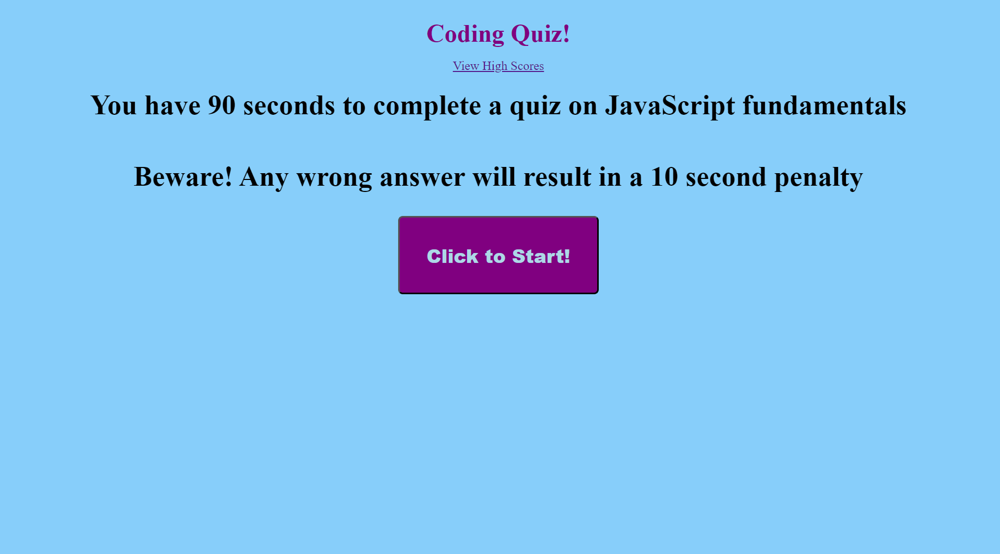
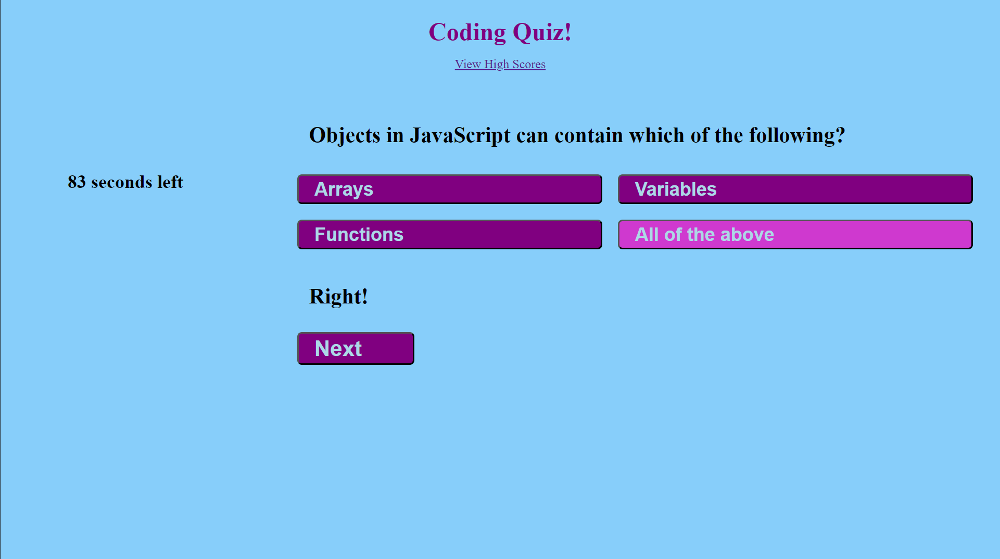
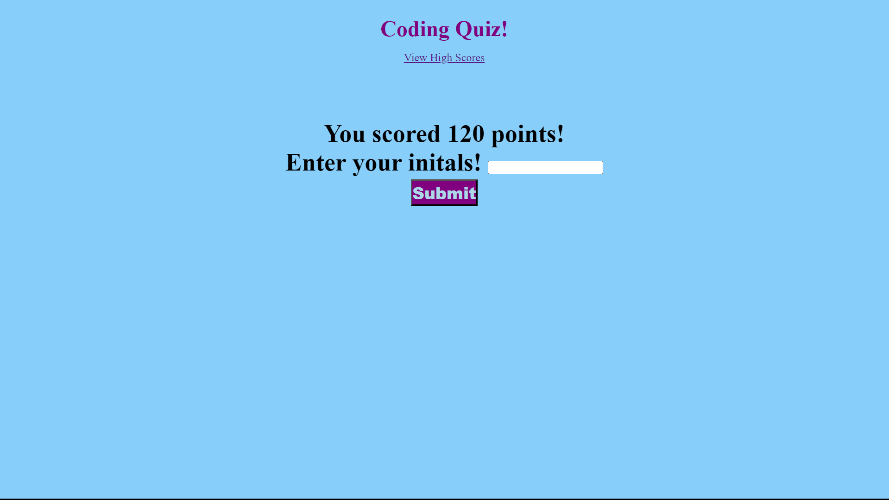
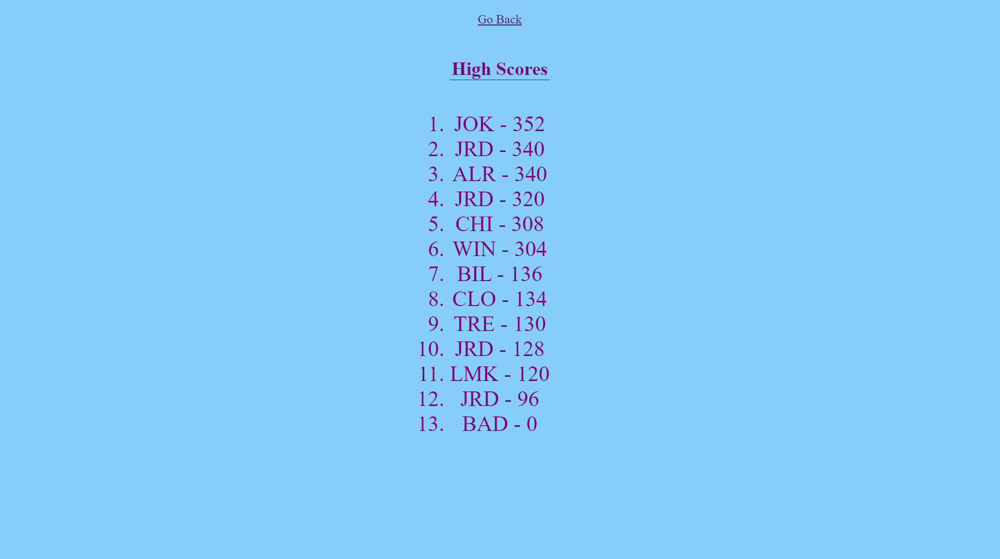

# Coding-Quiz
A timed quiz of coding fundementals.

https://justdesmarais.github.io/Coding-Quiz/

starter code repuprosed from: 

[justin-desmarais-portfolio project.](https://github.com/JustDesmarais/justin-desmarais-portfolio)

Questions array and select functions adapted from @GreatStack on Youtube, video titles [How To Make Quiz App Using JavaScript](https://www.youtube.com/watch?v=PBcqGxrr9g8).

## Screenshots

### Homescreen

Users are given instructions on the game and an intuitive interface with which to start the game.

### Question Screen

User is presented with a mulitple choice question.  If they select wrong, 10 seconds is removed from the timer.

### Initials Submission

Once a user has either completed all the questions OR the timer has hit zero, they are prompted to enter their intials for the leaderboard.

### Leaderboard

Users can view where their score ranks among their peers.

